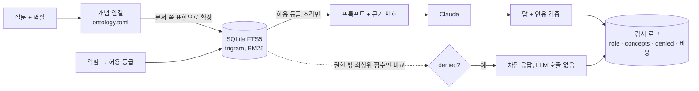

# citedesk — 온톨로지로 찾고, 권한으로 가리고, 출처를 붙여 답하는 문서 QA

사내 규정 같은 문서에 질문하면 **근거 문장에 번호를 붙여 답하고, 근거가 없으면 거절**합니다.
여기에 온톨로지 계층을 얹어 두 가지를 풀었습니다.

1. **사람이 쓰는 말 ≠ 문서가 쓰는 말.** "쉬는 날"이라고 물으면 문서의 "연차휴가"를 찾아야 합니다.
2. **답할 수 있어도 보여주면 안 되는 문서가 있다.** 급여 문서는 인사팀에게만 열리고, 권한 밖 본문은 LLM 프롬프트에 들어가지도 않습니다.

## 결과 (LLM 없이 재현되는 검색 지표)

`make eval` 로 그대로 재현됩니다. 검색 상위 4개(`top_k=4`) 안에 정답 문서가 있는지를 봅니다.

| 골든 세트 | 온톨로지 끔 | 온톨로지 켬 |
|---|---|---|
| `golden.jsonl` — 원래 표현에 가까운 질문 13개 | 77% (10/13) | **100%** (13/13) |
| `golden_paraphrase.jsonl` — 문서에 없는 말로 바꿔 물은 질문 13개 | **8%** (1/13) | **92%** (12/13) |
| `golden_access.jsonl` — 권한 밖 질문 차단 (3개) | 100% (3/3) | 100% (3/3) |

**읽을 때 주의할 점**
- 골든 세트와 온톨로지를 같은 사람이 함께 만들었습니다. 그래서 위 수치는 "온톨로지가 겨냥한 어휘 간극을 실제로 메운다"는 **시연**이지, 처음 보는 질문에 대한 일반화 성능이 아닙니다. 문서도 5개, 질문도 수십 개 규모입니다.
- 남은 실패 1건: "회사 컴퓨터에 개인 **메모리를 꽂아도** 되나요?" → 별칭이 `메모리 꽂` 이라 조사 `를` 이 끼면 연결되지 않고, 오히려 `컴퓨터`(장비 개념)에 걸려 onboarding.md 로 갑니다. 별칭 정규화(조사 제거)가 다음 과제입니다.
- 답변 정확도·인용 정확도 같은 LLM 지표는 이 표에 넣지 않았습니다. 실제 모델로 돌린 결과가 아직 없기 때문입니다(`citedesk eval` 에서 `--retrieval-only` 를 빼면 측정됩니다).
- 데모 서버는 키 없이 뜨도록 `FakeLLM`(첫 근거 문장을 그대로 인용)을 씁니다. 화면의 답변 품질은 실제 모델의 품질이 아닙니다.

## 구조



**온톨로지**(`data/ontology.toml`)는 세 가지를 담습니다.
- 개념과 `is_a` 계층 (연차·병가·경조사 → 휴가), 개념이 쓰는 두 종류의 말: `aliases`(사용자 표현) / `terms`(문서 표현)
- 개념 → 문서(`governed_by`, 없으면 부모에서 상속), 문서 → 담당 팀(`owned_by`)
- 문서의 접근 등급(`public / internal / restricted`)과 역할별 허용 등급. **등록되지 않은 문서는 restricted** 로 취급합니다(fail-closed).

로딩할 때 없는 부모, `is_a` 순환, 규율 문서가 없는 개념은 오류로 거절합니다.

**접근 제어를 설계한 방식**
- 등급 필터는 SQL `WHERE access IN (...)` 안에서 걸립니다. 권한 밖 본문은 파이썬 메모리에도 올라오지 않습니다.
- 권한 밖 조각은 "가장 관련 있는 문서가 그쪽인가"를 판단하려고 **점수만** 비교합니다. 그렇다면 `denied` 로 응답하고 LLM 을 부르지 않습니다.
- 응답과 `/graph.json` 에서도 권한 밖 문서가 규율하는 개념·문서 이름을 뺍니다.
- 모든 질문은 역할·연결된 개념·차단 여부와 함께 감사 로그(`GET /audit`)에 남습니다.
- 한계: 데모는 역할을 `X-Role` 헤더로 받습니다. 실제 배포에서는 로그인 토큰에서 꺼내야 합니다. 차단 응답 자체가 "관련 문서가 있다"는 사실은 알려줍니다.

## 비용 계산

`cost_usd = (입력 토큰 × 입력 단가 + 출력 토큰 × 출력 단가) / 1,000,000`, 토큰 수는 API 응답의 `usage` 값입니다.
단가는 `CITEDESK_USD_PER_MTOK_IN/OUT` 로 직접 넣으며 **기본값 0** 이라, 값을 넣기 전에는 비용 칸이 0 으로 찍힐 뿐 추정치를 만들지 않습니다.
근거가 없거나 차단된 질문은 LLM 을 부르지 않으므로 토큰도 비용도 0 입니다. 누적치는 `GET /stats`.

## 실행

```bash
docker compose up          # http://localhost:8000  (키 없이 FakeLLM 으로 뜸)
# 또는
make run                   # uv 필요
make test                  # pytest 21개
make eval                  # 온톨로지 켬/끔 비교
```

3D 화면(`/`)에서 역할을 바꿔 가며 질문해 보세요. 역할에 따라 그래프의 노드 수가 달라집니다.

```bash
uv run citedesk ask "쉬는 날은 일 년에 며칠이나 생기나요?"
uv run citedesk ask "주니어 개발자 연봉 밴드가 얼마인가요?" --role hr
uv run citedesk graph        # 온톨로지를 mermaid 로 출력
```

실제 모델을 쓰려면 `.env.example` 을 `.env` 로 복사해 `CITEDESK_USE_FAKE_LLM=false`, `ANTHROPIC_API_KEY`, 단가를 채웁니다.

## 기술 스택

Python 3.12 · FastAPI · SQLite FTS5(trigram) · Anthropic SDK · pytest · ruff · Docker ·
프론트는 빌드 없는 단일 HTML + [3d-force-graph](https://github.com/vasturiano/3d-force-graph) v1.80.0 (MIT, `web/vendor/` 에 동봉)

## 범위와 다음 단계

- 온톨로지는 사람이 씁니다. 문서에서 개념·관계를 자동 추출하는 부분은 없습니다.
- 벡터 검색과 결합한 하이브리드 검색, 별칭 정규화(조사 제거), 실제 모델로 답변·인용 정확도 측정이 남았습니다.
- 코퍼스는 이 저장소를 위해 만든 가상의 사내 규정입니다. 실제 회사 문서가 아닙니다.

## 내가 한 역할

개인 프로젝트입니다. 파이프라인, 온톨로지 스키마와 접근 제어, 평가 세트, 3D 뷰어 통합을 만들었습니다.

## 라이선스

MIT. 3D 뷰어 라이브러리의 라이선스는 `web/vendor/LICENSE-3d-force-graph`.
